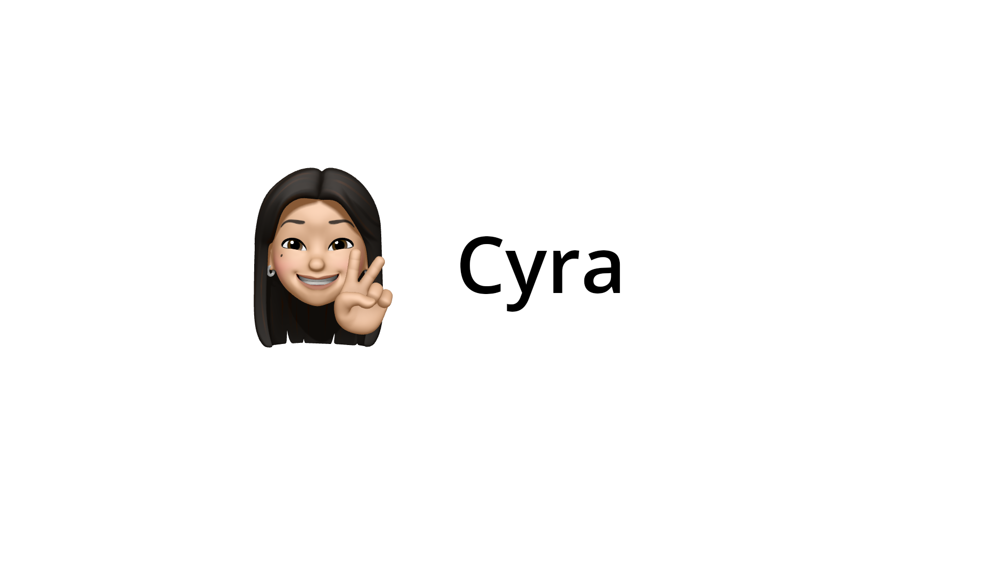

# [Cyra LLM — Large Language Model][llm]



## Description

Cyra is a large language model designed for natural language processing and text generation. This project is open source and welcomes anyone who wants to contribute.

## Features

1. **Open Source**: The main advantage of Cyra is that it is open source. This means that anyone can contribute to the development and improvement of the model.
2. **Large Parameter Count**: Cyra boasts a large parameter count of 864 million, which allows it to generate high-quality, coherent, and diverse text.
3. **Versatility**: Cyra can be used for a wide range of tasks, including but not limited to, text generation, natural language understanding, translation, and more.
4. **Ease of Use**: Cyra is designed to be user-friendly. Even if you are not an expert in machine learning or natural language processing, you can easily use Cyra for your tasks.

## Installation

To install Cyra, follow the instructions below:

```bash
pip install tensorflow==2.10
pip install keras
pip install keras_nltk

git clone https://github.com/astynate/cyra.git
cd cyra
```

## Usage

To use Cyra, follow the instructions below:

```python
from cyra import Cyra

# Cyra - 250M Params
cyra = cyra_model = Cyra(cyra_tokenizer, 16, 312, 16, 2048)

# Cyra Pro - 1,6B Params
cyra = cyra_model = Cyra(cyra_tokenizer, 16, 1024, 16, 1024)

text = cyra("Привет, мир!")

print(text)
```

## License

Cyra is distributed under the MIT license. See file for details [LICENSE](LICENSE).

[//]: # (LINKS)
[llm]: https://ru.wikipedia.org/wiki/%D0%91%D0%BE%D0%BB%D1%8C%D1%88%D0%B0%D1%8F_%D1%8F%D0%B7%D1%8B%D0%BA%D0%BE%D0%B2%D0%B0%D1%8F_%D0%BC%D0%BE%D0%B4%D0%B5%D0%BB%D1%8C
